# README: S3 Restore Request Agent

## Overview

This project automates the restoration of objects in S3 buckets to the STANDARD storage class. The agent performs the following steps:

1. Generates a unique request ID.
2. Creates a database record for the restore request.
3. Sends a Slack notification about the creation of the DB record.
4. Assumes an AWS role for required permissions.
5. Renews credentials every 30 minutes.
6. Parses the provided S3 bucket paths.
7. Restores objects in each path to the STANDARD storage class.
8. Updates the processed paths in the database.
9. Sends a final Slack notification about the completion.

## Flow Diagram

```mermaid
graph TD
    START["🏁 Start"] --> GENID["🔑 Generate Request ID"]
    GENID --> DBREC["🗄️ Create DB Record"]
    DBREC --> SLACKNOTIF["🔔 Send Slack Notification"]
    SLACKNOTIF --> ASSUMEROLE["🔐 Assume Role"]
    ASSUMEROLE --> RENEWCREDS["🔄 Renew Credentials (every 30 mins)"]
    DBREC --> PARSEPATHS["📂 Parse Bucket Paths"]
    PARSEPATHS -->|Each Path| RESTOREOBJ["⚙️ Restore Objects in Path"]
    RESTOREOBJ --> CHECKSTORAGE["🔍 Check Storage Class"]
    CHECKSTORAGE -->|If Not Standard| COPYOBJ["📦 Copy Object to STANDARD Storage Class"]
    COPYOBJ --> WAIT["⏳ Wait for Processing"]
    WAIT --> CHECKSTORAGE
    CHECKSTORAGE --> UPDATEPATHS["📝 Update Processed Paths"]
    UPDATEPATHS --> FINALCHECK["🔍 Final Check"]
    FINALCHECK -->|If All Processed| DELETERECORD["🗑️ Delete DB Record"]
    DELETERECORD --> FINALSLACK["🔔 Send Final Slack Notification"]
    FINALCHECK -->|If Not All Processed| PARSEPATHS
    UPDATEPATHS --> FINALSLACK
    FINALSLACK --> END["🏁 End"]
```



## Terraform Variables

The following variables can be configured in your Terraform setup to customize the agent:

```hcl
variable "agent_name" {
  description = "Name of the agent"
  type        = string
}

variable "kubiya_runner" {
  description = "Runner for the agent"
  type        = string
}

variable "agent_description" {
  description = "Description of the agent"
  type        = string
}

variable "agent_instructions" {
  description = "Instructions for the agent"
  type        = string
}

variable "llm_model" {
  description = "Model to be used by the agent"
  type        = string
}

variable "agent_image" {
  description = "Image for the agent"
  type        = string
}

variable "secrets" {
  description = "Secrets for the agent"
  type        = list(string)
}

variable "integrations" {
  description = "Integrations for the agent"
  type        = list(string)
}

variable "users" {
  description = "Users for the agent"
  type        = list(string)
}

variable "groups" {
  description = "Groups for the agent"
  type        = list(string)
}

variable "agent_tool_sources" {
  description = "Sources (can be URLs such as GitHub repositories or gist URLs) for the tools accessed by the agent"
  type        = list(string)
  default     = ["https://github.com/kubiyabot/community-tools"]
}

variable "links" {
  description = "Links for the agent"
  type        = list(string)
  default     = []
}

variable "debug" {
  description = "Enable debug mode"
  type        = bool
  default     = false
}

variable "dry_run" {
  description = "Enable dry run mode (no changes will be made to infrastructure from the agent)"
  type        = bool
  default     = false
}

variable "log_level" {
  description = "Log level"
  type        = string
  default     = "INFO"
}
```

## Usage

1. Configure the variables in your Terraform configuration file.
2. Deploy the Terraform module to set up the S3 Restore Request Agent.
3. The agent will handle S3 restore requests as described in the flow diagram.

## Additional Notes

- Ensure that the AWS credentials and roles are properly configured to allow the agent to assume the required roles and perform S3 operations.
- Monitor the Slack notifications for updates on the restoration process and any required approvals.
